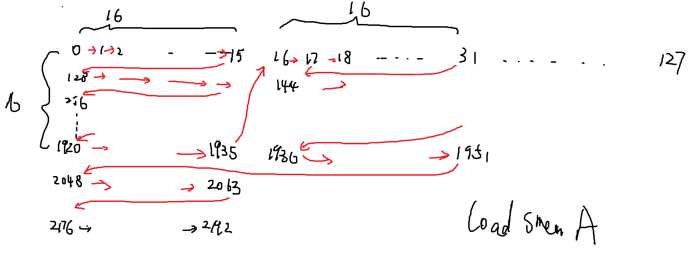
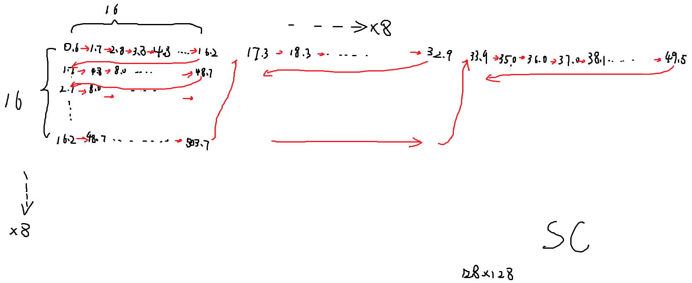

这里面的几个文件都是用于比较具体值的对应位置的。额。result.txt可能不太对，好像是用matmul1测的。其他俩都是matmul0写出来的。

最开始会有从kernel内部打印出来的smem_A或者smem_C的值。最后则打印出result和MatrixA的值。相对比可以得到下图这样的关系。

## **A矩阵**

黑色是从左到右的row major的global的顺序，红色箭头顺序是smem_A的顺序。

## **C矩阵**

C的区别就是smem_C更宽，有128，而A是32。

啊 使用两个`符号`就可以产生阴影效果！