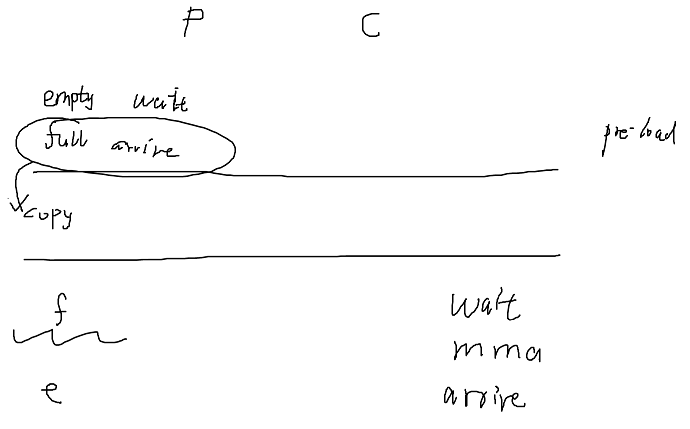
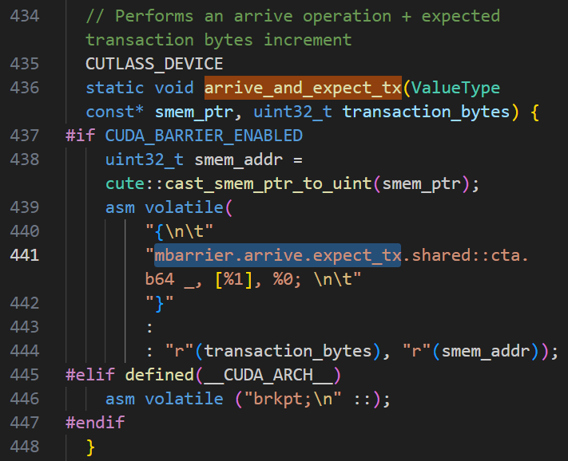

项目整体愿景：
使用数据流方法，在减少sync 开销的同时，充分利用各级缓存，减少memory traffic带来的开销。针对memory bound问题。原先的缓存命中率较低，经过数据流方法之后能够显著提高。现在需要找到合适的使用场景。

related work:

TileFlow: A Framework for Modeling Fusion Dataflow via Tree-based Analysis
Cusync: A Framework for Fine-Grained Synchronization of Dependent GPU Kernels

Welder: Scheduling Deep Learning Memory Access via Tile-graph

Chimera: An Analytical Optimizing Framework for Effective Compute-intensive Operators Fusion

Souffle: Optimizing Deep Learning Inference via Global Analysis and Tensor Expressions

Rethinking Latency-Aware DNN Design With GPU Tail Effect Analysis（1. 揭示了DNN优化中很多剪枝等操作没有带来线性提升，而是阶梯式上升，原因是尾部效益。2. 根据尾部效应来指导算法剪枝等优化。3. 不过没有真的解决尾部效益本身。）

| Framework | baseline |    features    |
|-----------|-------------------------------------------------------------------------------------|
| TileFlow  |       |           |
| Cusync    |       |           |
| Welder    |       |           |
| Chimera   |       |           |
| Souffle   | Bert等。。  |kernel融合（global）以消除启动开销；global sync|
| Optimus   |        |          |
| MASTRO   |        |           |
lean attention(虽然还没发出来吗。。)
block parallel transformer
Rethinking Latency-Aware DNN Design with GPU Tail Effect Analysis
streamK


0512
1. 今天写了GUI，能够设定矩阵乘法的MNK尺寸，cache的大小。每次点击方框能够计算当前cache内的值和截至目前的global memory access。并且有undo按钮回撤到上一步。作用是帮助理解为什么不同Z字形的memory access不一样，想获得某种intuition。
2. 打算明天用暴力搜索的方式，对3*3或者4*4来搜索，找到最优的所有路径。目标是最小化global memory access。总共有组合数A_4_4种可能，当然限定初始必须从0,0开始。
3. 据此的intuition来思考，怎么描述所有路径？真的必须暴力搜索吗？目前还是没有思路。。


我的互动的图需要加上每一步的箭头。更容易看出路径

0520
今天测了FFN的性能。主要关注的是是否memory bound以及L2命中率。。。针对lamma3-8B和lamma3-70B在A100，A40,4090和本机的3050上测了。结果大多都是compute bound，L2命中率都在80%以上。在本机的3050上偶尔能memory bound。总之就是性能很不如预期。。。

那么怎么寻找memory bound的场景呢？1. 稀疏矩阵乘法？2. decoding（此时attention和FFN好像都是memory bound）

0521
1. GUI_cache.py是什么？
之前想探究最优的GEMM路径，为了寻找intuition，做了这个GUI，能够手动去计算每次的计算路径，然后显示出当前步的总的global memory access，并且能够回退到上一步。
2. attention的哪部分是memory bound？
attention一般有两个GEMM，我们先不考虑element-wise操作，那就是第一个GEMM比较memory bound。原因是，K维度很小，计算复用很少。而L2命中率一般是第二个GEMM更低，因为Q*K的中间结果很大，难以存到缓存上。

下一步工作计划：
测试不同参数下的memory bound和L2命中率情况。寻找合适场景进行实验。

0604
关于L2数据流的一些思考：
1. 为了优先利用中间结果，GEMM0的一行算完之后立刻执行GEMM1的对应的一行
2. 由于FFN的形状，GEMM1的宽度较小，所以选择一次走完GEMM1的一行，而不切分。（如果切分，那么就无法享受中间结果了，就彻底丢到最后面再处理）
3. 由于依赖关系，GEMM1不存在hilbert式回环走法
4. GEMM1的值算完存回DRAM，然后再读上来再加。这可能造成一点额外开销。。
5. 但是考虑到残差结构，尽快算完GEMM0和GEMM1的一整行是有利的，这样输入的A还能尽可能留在L2，也就是说Z字形的纵向的高矮不要太高
6. 也应该用global memory access来衡量性能
7. 考虑到attention的残差结构，不应该在attention没算完，就把中间结果拿来算FFN。也就是说，attention和FFN的L2数据流是分开的。


paper 阅读思考：

卷积加速器中的通信下界

take away：
1. 数据流。。能加速，是不是也可以找数据额外流动带来的能量消耗？（这个肯定要做）
2. 我需要的数据流不仅是GEMM。。而应该是transformer架构下的多个kernel的综合设计。怎么理论上分析找到多个kernel的最小通信量？（可以用红蓝卵石方法吗？）优化空间有多大呢？
3. 加速器常用global SRAM buffer，然而GPU进行了切分。

```
话说为什么GPU的shared memory是每个SM内部的，而加速器往往是全局连起来的啊？

主要原因。。我猜是因为全局连起来的传输速度会很慢？比如SM0要访问存在SM107的shared memory的值。。
```

在局部切分情况下，最优通信是多少？（COSMA已经论证了）
如果全局连通，考虑上远距离访问的开销，数据怎么放置是最优的？（这个问题好像有点远）


我好像可以做kernel间L2数据流，然后选择A40，大M。然后不使用cutlass的swizzle。因为我们做的是kernel间。。。有点tricky，但是好像也可以。说不定再试试看3050那种显存很垃圾的显卡？可能更bound


缺点：
4. 本文对片上通信的操作基本没有做优化，只是用了GEMM的常规blocking操作而已。
5. 真的需要单独的CNN架构吗。。。GPU也可以吧。。只是想证明在不同配置上都能够达到最小访存量的话，其实GPU-sim也足够了？
6. 我看L2 throughput还没有拉满。。每次是循环到需要值的时候，才从DRAM读值。能不能一开始就制定好哪些值需要，然后一直连续不停的最大功率从DRAM读到L2（可以。。但是目前L2命中率都那么高了，明显不是bound。。。）
7. 本文。。也没有如其所说，对给定的硬件配置，选择合理的参数啊？甚至连最优tile size都没讨论。。


现在想想看两个GEMM的数据流，能不能用红蓝卵石方法得到通信下界？（L2上）


结论：没有想明白L2上最优memory access的理论值。。可以抽象为：有P个处理器连接一个高速缓存（L2），再连接一个低速缓存（DRAM），当下的模型都没有这一层L2。


明天的工作计划：
看论文
leanAttention，对比其与flash的区别
graphneIR，找到我的计算方法的表达


0607
给学长汇报：
1. 我的数据流设计思路
**针对decoding：统一所有kernel的block size，总体只有一个kernel。（可以先做？因为比较简单）

问：可能存在死锁？


**针对training：attention（用L1数据流）和projection融（L2数据流），FFN内部融（用flash和L2数据流）（这里没法用L1数据流）。描述两个GEMM的融合方案，有哪些参数可调？-->projection（不改变原尺寸，从(batch_size * seq_len) x d_model开始和结束。参考尺寸：8192*4096）
--->多个head的concatenate是按列来拼的。


问：仔细想一想GEMM1的计算顺序

答：
14336*4096*2/1024/1024=112MB，太大了。这是GEMM1的权重。那么我倾向于每次GEMM0计算都atomic加到全局内存的GEMM1的第一列上去，然后GEMM1的后几列等GEMM0都算完之后再单独计算。或者等GEMM0的对应一行都算完之后，再对GEMM1的一行进行计算（一次算完一整行吧）（不过我不看好这种。。因为GEMM1的权重太大了。。。）

一个想法：如果M比较大，横着Z好像不错，那如果M比较小，两个GEMM是不是就相当于N很大？纵向的N先向下，然后一路向右，N的高度较小，这样中间结果还能被利用，如何？（去看明白cutlass到底是怎么Z的）


下一步思考：从L2角度，attention-projection块和后面的FFN块怎么融？这样，我们仅考虑两个kernel间进行融合，先不考虑多个kernel混杂。然后我们限定前一个kernel的一行，作为最小粒度，执行完前一个行之后，才可以安排后面kernel的对应一行。这种方式就可以融合projection和FFN-GEMM0了。具体怎么排，实验验证吧。


在block执行速度不一样，或者同一种block但是对缓存的命中率不一样的情况下，不能认为先发射就先执行。每个block都需要验证依赖项计算完成。但是调整计算顺序可以最小化等待开销。


2. 简要阐述两篇paper看到了啥（文字即可）
3. 下周工作计划：尽快写代码（以及，冷老师希望L2数据流之类的先不要写模拟器找理论最优什么的，还是实测，要在GPU上拿到提升）
4. 问：要看flash attention吗？是不是大致搞明白怎么回事即可？全看懂好困难啊。。。（还是要硬啃的）
5. motivation：计算能力增长远快于内存速度增长（图来自冷老师的slide），memory wall优化是HPC的重要问题
6. CNN多了一个数据复用的维度，说不定优化空间更大？有时间可以看看：
“openai有一个开源的CLIP，有两种开源的backbone，一种实现是RESNET，另一种是ViT吧，大概是这样。。那个基于resnet的就是CNN”
“cnn based SD”
“在资源受限的边缘场景下还是会用CNN的，比如工厂的自动探测摄像头，就用resnet那种。大模型下面，那还是transformer占主导吧”
总之，也可以搞，但是好像意义不是特别大。


0608
1. 研究清楚decoding下的矩阵乘法GEMM/GEMV到底怎么写的

引用自《Flash Decoding++》：

> GEMV工作负载可以通过利用FastGEMV等先前设计中的CUDA Core来优化。对于解码阶段的Llama2-7B线性层，cuBLAS的张量核心实现仅达到在NVIDIA A100 GPU上使用FastGEMV的CUDA Core实现的82.15%的性能。另一方面，与张量核心实现相比，使用CUDA Core在batchsize=4的解码输入上进行投影仅达到49.75%的性能。

所以为了方便，我可以选batch=16，用cutlass/tensor core。

3. 测flash decoding并理解其细节，对比。


0611

1. 测试后发现对于M=16，N=14336（或乘10以确保wave足够多），K=4096，使用block_size=(128,256)并不比(64,....)要慢。实验在A40上测的很多，A100上稍微测了下。这保证了我可以使用大block，来和flash进行融合
2. 吐槽cusync的不足：使用多个stream，无法控制block的先后，对cutlass则必须使用cutlass::gemm::threadblock::CuSyncGemmHorizontalThreadblockSwizzle，这损害了L2的性能（虽然还没测其具体L2性能。。。）
3. 对于两个GEMM的执行顺序，可以算GEMM0的一行的一半，就立刻去算GEMM1的对应一行；可以尽快算完GEMM0的一行，然后就跑去算GEMM1的对应一行；可以算完GEMM0的好几行，然后再去算GEMM1的对应几行。
4. 修改cutlass的输入参数。现在我还需要输入D。判断，如果是consumer，就使用C和D，如果是producer就使用A和B。sync的方法暂时先不管。研究cutlass里面的block是二维的？执行顺序如何？

0612
1. 研究cusync-cutlass内的代码，相互的关系如何？（从而找到如何加入input D）
2. cusync-cutlass文件夹底下的文件结构，相互依赖的关系：
gemm/
- device/
  - cusyncgemm.h
- kernel/
  - cusyncgemm.h
  - default_cusyncgemm.h
- threadblock/
  - cusync_threadblock_swizzle.h
  - cusyncmma_multistage.h
  - cusyncmma_pipelined.h
  - default_cusyncmma.h

在device/cusyncgemm.h里定义了两个class cusyncgemm，后者是对前者在columnMajor情况下的特化，暂时不管。
cusyncgemm引用了kernel/default_cusyncgemm.h来实例化自己。而kernel/default_cusyncgemm.h又引用了kernel/cusyncgemm.h。


### **kernel/default_cusyncgemm.h包含以下内容：**  
/// Partial specialization for Hopper Architecture  
/// Partial specialization for Ampere Architecture  
/// Partial specialization for Turing Architecture     
/// Partial specialization for Ampere Integer Matrix Multiply Interleaved layout  
/// Partial specialization for Turing Integer Matrix Multiply Interleaved layout  
/// Partial specialization for Volta architecture  
/// Partial specialization for SIMT  
/// Partial specialization for Ampere  
/// Partial specialization for SIMT DP4A  
/// Partial specialization for Wmma Gemm Kernel  

这里面基本都差不多，只是在模板里面的arch参数不一样而已。每个struct内最后一行是using GemmKernel = kernel::CuSyncGemm<CuStageImpl, Mma, Epilogue, ThreadblockSwizzle, SplitKSerial>;
而这就进入了kernel/cusyncgemm.h

### kernel/cusyncgemm.h包含以下内容
执行GEMM的主要内容。里面的semaphore不用管，那就是splitK和cutlass原生带有的东西。但是关注其中的custage.的内容。


明天想明白：
1. custage.post是怎么工作的？为什么要if consumer?-->怎么工作的暂时不管。原先就可以if consumer。custage.wait藏在mma里面
2. 那段代码里，执行mma的在哪里？-->找到了


1. 去研究cutlass的swizzle是怎么实现的？确定是Z字形吗？

0613
如文件夹block_swizzle里所述，那是在3050 laptop上测的，figure1明显表明了1d情况下block发射顺序和idx.x完全正相关。明天要考虑，cutlass的swizzle是在2d情况下实现的，这是不是对我的融合造成了阻碍？或者。。能不能只在z维度上进行调整？

0623
结果速报：
FFN0和FFN1成功融合到一个kernel，尚未（也不一定打算）再融flash decoding进去。以下时长循环20次取平均，有1个warm up时长不计
1. 按我的思路发射一整个kernel，一次平均663us
2. cusync策略分两个stream和wait kernel，一次平均746us

之前预期能够从2个wave变成1个wave。但是不同kernel的一个wave时长是不一样的，速度提升达不到50%。

先回家睡个觉，明天深入分析一下

(base) a40-01% build/mlp-eval-rowsync --batch 16 --check true --model gpt3 --split-k1 1 --split-k2 1 --policy cusync
model=gpt3 batch=16 check=1 policy= cusync
GeMM 1 Size: 16, 14336, 4096
GeMM 2 Size: 16, 4096, 14336
1082 line
Checking first GeMM
First GeMM passed
Checking second GeMM
Second GeMM passed
START-OVERLAPPED:
END-OVERLAPPED:
Average time 746.291217 microseconds


(base) a40-01% build/mlp-eval-rowsync --batch 16 --check true --model gpt3 --split-k1 1 --split-k2 1 --policy cusync
model=gpt3 batch=16 check=1 policy= cusync
GeMM 1 Size: 16, 14336, 4096
GeMM 2 Size: 16, 4096, 14336
enter kernel/cusyncgemm.h
1082 line
Checking first GeMM
First GeMM passed
Checking second GeMM
Second GeMM passed
1089 line
enter kernel/cusyncgemm.h
START-OVERLAPPED:
enter kernel/cusyncgemm.h
END-OVERLAPPED:
Average time 663.552002 microseconds

0625

1. 继续思考我的工作如何总结一个abstract出来。
2. 我的工作和cusync区别在哪？


```
1. cusync的order不是不同stream之间的执行order，而是消费者stream和生产者按照相同顺序来执行计算，目的是让等待时间会更短。也就是说cusync不能真正控制prod和cons相互之间的执行顺序。--->所以我需要真的控制执行顺序，写出代码证明L2命中率我能更高。。。（比如我提出一种可能性：算完GEMM0的一整行后，不要完整的算GEMM1的一整行，而是算一半行，否则GEMM1的权重会极大的污染L2）
2. 我的优势其一在于idx方法比stream更快。（stream开销大）
3. 其二在于idx方法更灵活，能更细粒度的控制block执行顺序。
4. 并且cusync仅考虑一对一的简单情形，没有考虑多对多的复杂场景，idx的引入扩展了执行顺序的搜索空间。
5. 当前多个stream和wait kernel的设计，不能最小化空等的消费者block。依然有可能发射大量的消费者block而空等。idx方法可以完全消除这个问题。“因此，cuSync确保消费者内核的线程块不会排在至少一个生产者内核的线程块之前。”---->因此，如果有三个stream，那就是第一个stream产生一个block，就开启第二个stream，第二个stream产生一个block，就开启第三个stream，这样空等就可能很多。stream越多越乱，而论文里确实也没有测更多的e2e的场景（我可以试一下！）
```

```
cusync 是不是可以总结为没做kernel fusion，是通过信号量/wait kernel，控制不同的stream的kernel内部的CTA的同步

所以cusync和你的差别是：
1. kernel之间的数据复用。不管是L1还是L2的数据复用，cusync都完全没法去处理
2. stream management/kernel launch开销。
3. 管理的能力有差别，相比于cusync，你的工作能够打破XX约束

我这里的第3点是看的你的进一步的总结。但是我其实不确定真实性/可靠性。你自己需要确认一下。我感觉应该是叫做intra-kernel 和 inter-kernel 的同步管理，可能他的能力确实比你的少，但是你现在的总结还是太乱了。
```

0626

当前128版本能够跑通，多个test也可以。但是64版本好像不行。是不是smem之类的要调整调整什么的。明天再想想看。

0726 
待做的事情：
1. 冷老师给的帖子，分析了L2和attention相关的内容：https://zhuanlan.zhihu.com/p/708776013
2. 杨杰学长提醒我，在Hopper的cluster里，smid和block似乎能对应上，和L2数据流能搞到一起。

但是上述两点都是L2相关的，我暂时优先做L1的。所以以后再看啦


0822
上午开组会。老师让我和子汉合到一起为一篇工作。
下午重构cutlass。因为之前的工作改的比较乱。就是在全新的cutlass上执行以下四步修改：

1. 消除persistent
2. 修改block计算顺序为横向
3. 创建gemm1_weight
4. 修改storage_C

上述任务完成了。到晚上九点为止。并且实现了TMA版本下，取消掉while循环。

0823
上午开会中午开会
主要自己在写代码。完成了将完全单独一个block执行变成了一横行的persistent。以及，部分找到了k_tile的gemm1的迭代位置。
开会的take away来自罗新浩的分享，有两张图，介绍了llamma3.1的prefill和decode的各自的latency。
下午5:30继续开始写代码

晚上给GEMM1加上了外层while。写好了k的值。并翻译完了奥林巴斯的PPT

0824
1. 理解了local_tile的工作原理，记录在hzy_技术文档
2. 大体完成了load_partial。还差最后的multi-stage的细节。
3. 改好了load_init。加入了gemm1_weight的初始化。

之后的任务：
1. 对GEMM1的load_partial是读取D矩阵以及读取共享内存的GEMM0结果。（搞定了）
2. 这里对GEMM0怎么读取进来？什么格式？张量怎么排布？顺便研究一下是怎么使用barrier的
3. 执行store。修改读取，从GEMM0-D共享内存读取A矩阵。目前就使用default-epilogue直接存出到global，而不经过共享内存。
4. 在consumer里面增加TMA-reduce。
5. 存出到global。创建GEMM1-最终结果的存储位置。

0825
1. 研究为什么copy会导致错误而退出--->用tma_b暂时不会错误了。
2. 研究为什么没有copy会循环无法出来。---->我感觉就是缺少consumer。k_tile_count（比如是32）应该无所谓的。反正每次达到stages（比如是3）数就卡住等consumer。然后再继续执行k_tile_count。

16+32--48kb
64kb
227-64=163
163/48=3 所以stages=3

在初始化pipelineState的时候就会把stages传给Mainloop类，然后从Mainloop里面调用出pipelineState。

1. 去看大致producer和consumer是怎么配合的。---->看到了pipelineState。知道了里面的count，stages，phase三个变量和advance函数。stage呢，就是说有多个barrier同时在运行，phase就是说完成与否。所以是有stages*phase个信号量。count没什么用。
2. 理解并修改mma。-->先修改为读D权重，然后再修改为读共享内存的GEMM0的结果////读D容易。因为之前就写到了B里面去，就不需要改了。
3. 看懂consumer里面剩下的其他东西。
4. 整个拼起来。

今晚卡在对mma的理解上。底层到底为什么卡住了？是barrier.wait这里。具体原因只能明天去研究了。

0826
1. 研究到底为什么barrier卡住了。
底层原因我不想关心了。首先，先把GEMM0的代码搬迁过来，直到能够跑通。
然后根据GEMM0的写法，逐步修改load和mma。

1. 先增加GEMM1的存出，创建空变量。名字叫gemm1_output
2. 将存出改为gemm1_output
3. 逐渐修改load和mma成_gemm1的格式。


修改mma_gemm1为去读取SMEM的值。
先去看，load到共享内存的B矩阵是什么layout。然后检查我们存到共享内存的D是什么layout。

额。。。load里面发现，必须要两个copy才能往下走。。。哪怕是copyA和gemm1_weight都可以。为什么呢？


A+B 可以------copyA copyB
A+G 可以------copyA copyG
B+G 卡死（但是注意B和G都是写到同一块SMEM位置）
A      卡死
B      卡死
G      卡死

很大可能是，对数量在什么地方有限制。

会不会是A的定义的过程中有什么必须后续执行的限制？不会。我把load_new里面和A相关的都注释掉。也卡死了。

1. 可能是copy自带的限制？那么要深入去找copy定义在哪里。一路上溯。
2. 可能是是tma_load_a这种地方的限制？那么去上溯tma的定义。

0827
copy上层的with的位置找到了：temp_can/cutlass-new/include/cute/atom/copy_traits_sm90_tma.hpp
  // Construct an executable SM90_TMA_LOAD with tma_mbar
  CUTE_HOST_DEVICE constexpr
  Copy_Traits<SM90_TMA_LOAD_OP, NumBitsPerTMA>
  with(
    uint64_t& tma_mbar,
    [[maybe_unused]] uint16_t const& multicast_mask = 0,
    TMA::CacheHintSm90 const& cache_hint = TMA::CacheHintSm90::EVICT_NORMAL) const {
    // We accept multicast_mask here to keep the API for both atoms consistent
    return {{}, {&tma_desc_, &tma_mbar, static_cast<uint64_t>(cache_hint)}};
  }

  // Construct an executable SM90_TMA_LOAD with tma_mbar (temp. overloaded for grouped gemm/ptr array gemm)
  CUTE_HOST_DEVICE constexpr
  Copy_Traits<SM90_TMA_LOAD_OP, NumBitsPerTMA>
  with(
    TmaDescriptor const* new_tma_desc,
    uint64_t& tma_mbar,
    [[maybe_unused]] uint16_t const& multicast_mask = 0,
    TMA::CacheHintSm90 const& cache_hint = TMA::CacheHintSm90::EVICT_NORMAL) const {
    // We accept multicast_mask here to keep the API for both atoms consistent
    return {{}, {new_tma_desc, &tma_mbar, static_cast<uint64_t>(cache_hint)}};
  }
不过这边有很多with，搞不清是哪个

通过加入很多printf，寻找到了一些会出现copy的位置（不保证完全，且因为cuda-gdb有问题，暂无法确定调用栈顺序）：
temp_can/cutlass-new/include/cute/arch/copy_sm90.hpp
    // printf("sm90 165\n");
temp_can/cutlass-new/include/cute/arch/copy_sm90_tma.hpp
    // printf("145\n");


我的思路：
1. 检查init---------搞明白了empty_barrier和full_barrier的关系，如图。

2. 检查出现barrier的地方。copy是否动了barrier？------>有待考察！！！！！！

1. 理解full_barrier和empty_barrier具体是怎么工作的？
2. 尝试修改num_consumer_warpgroups_per_cluster这个参数为其他值。--->确实会卡死！这是影响因素。


学习了mbarrier的PTX细节。但是没有搞清楚继续执行的条件是否需要所有到达的phase/state值也必须一致？
1. 语法是mbarrier.arrive{.sem}{.scope}{.shared{::cluster}}.b64       -, [addr]{, count};，不过这里的.sem, .scope都是可选的。所以我们这里就省略了这俩。
2. arrive和wait是相互配合的，arrive告知wait，当前达到的数量。

看到  // Wait for producer to commit transactions (done by TMA)这句话。看来是TMA执行完内存load操作后会自动执行commit，不需要手动写commit代码。

似乎和full_barrier关系很大。但是这个的初始化就简简单单是1啊？


0828
通过printf，确定到，就是卡在了consumer的consumer_wait那里。所以反推就要去研究full_barrier。很可能是copy里有对full_barrier的提交。（但是，最初init full_barrier就是1，为什么会需要copy的两次提交呢？难道这两个能怎么整合为一个提交吗？）


full_barrier是使用expect-tx！？这是什么作用（根据PTX，似乎是增加tx-count）？难道是这里从1个阈值增长到2个阈值吗？（如图）
